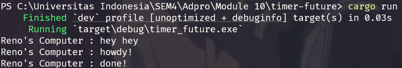
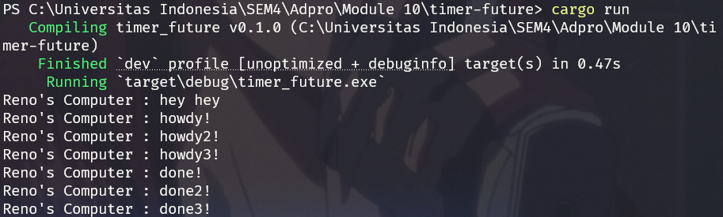
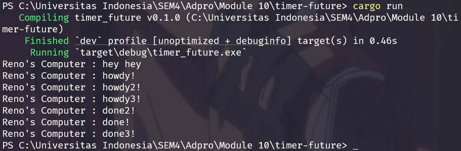

### Understanding How it Works

In asynchronous programming, instructions don't necessarily run in the order they're written. In this example, the `main()` function starts by creating an executor and a spawner. It then uses the spawner to launch an asynchronous task using `spawn`, but this doesn't execute the task right away—it merely schedules it. After spawning the task, `main()` prints "Spawner has been called, task will run asynchronously." to indicate the task is queued. It then immediately prints "hey hey". The asynchronous task doesn't begin until the executor is run at the end of `main()`, at which point it picks up the task. The task then waits two seconds, prints "howdy!", and finally prints "done!". This sequence happens because the executor is responsible for running the asynchronous task, while the rest of `main()` runs without waiting for it.

### Multiple Spawn and Removing Drop

In this scenario, the spawner is invoked three times, creating three independent tasks that execute concurrently on separate threads. The output, especially the "hey hey" message, reflects the order in which the tasks are spawned—so the messages will consistently appear as howdy1, howdy2, howdy3, followed by done1, done2, and done3. These tasks run simultaneously and don't wait for one another to finish. The `drop(spawner)` call is important because it informs the executor that no additional tasks will be submitted. Without this call, the program keeps running, as the executor remains open to receiving more tasks. By calling `drop(spawner)`, the executor knows task submission is complete, and it allows the program to exit once all active tasks have finished.
